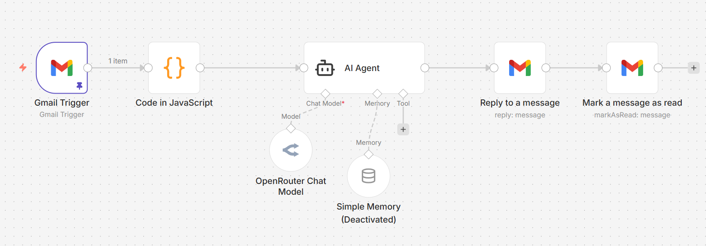

# Auto-Gmail-Reply-Agent

## Overview

Auto-Gmail-Reply-Agent is an automated email response workflow built using [n8n](https://n8n.io/), an open-source workflow automation tool. This project demonstrates a practical application of n8n for integrating Gmail with AI-powered reply generation, showcasing my proficiency in designing, configuring, and deploying n8n workflows for real-world automation tasks.

## Project Purpose

The primary goal of this project is to automatically reply to incoming emails in Gmail that match specific criteria, such as being unread and having a particular label. The workflow ensures prompt, consistent, and context-aware responses, reducing manual effort and improving communication efficiency.

## Workflow Explanation

The workflow consists of the following key components:

1. **Gmail Trigger**: Monitors the Gmail inbox for unread emails with a specified label. It polls every minute to ensure timely detection of new messages.
2. **Code in JavaScript**: Extracts the sender's name from the email metadata, preparing it for personalized replies.
3. **AI Agent**: Utilizes a language model to generate a concise, polite reply based on the email content and sender's name, following predefined rules for tone and brevity.
4. **Reply to a Message**: Sends the AI-generated reply to the original sender using Gmail.
5. **Mark a Message as Read**: Updates the email status to "read" after replying, preventing duplicate responses.

Optional: A memory buffer node is included for session management, though it is currently disabled.

## n8n Features Utilized

- **Node-based workflow design**: Leveraging n8n's visual editor to connect and configure nodes for seamless automation.
- **Gmail integration**: Using OAuth2 credentials for secure access and operations on Gmail.
- **Custom JavaScript code**: Enhancing data processing and personalization within the workflow.
- **AI integration**: Connecting to external language models for dynamic reply generation.
- **Workflow chaining**: Ensuring logical progression from email detection to response and status update.

## Screenshot

Below is a screenshot of the workflow as implemented in n8n:

## How It Works

1. The workflow is triggered when a new, unread email with the specified label arrives in the Gmail inbox.
2. The sender's name is extracted for personalization.
3. The email content is passed to an AI agent, which generates a reply according to strict rules (politeness, brevity, no unnecessary follow-up).
4. The reply is sent automatically to the sender.
5. The email is marked as read to avoid repeated replies.

## Demonstrated Skills

- Proficient use of n8n for workflow automation
- Integration of Gmail and AI services
- Custom data processing with JavaScript
- Secure credential management
- Workflow documentation and best practices

## Getting Started

To deploy or modify this workflow:

1. Install and configure n8n on your system.
2. Import the provided workflow JSON file.
3. Set up Gmail and AI service credentials as required.
4. Adjust label IDs and filters to match your use case.
5. Activate the workflow and monitor its execution.

## Conclusion

This project exemplifies the power and flexibility of n8n for automating complex tasks involving email and AI. It highlights my ability to design robust, maintainable workflows that address real-world needs with clarity and precision.
